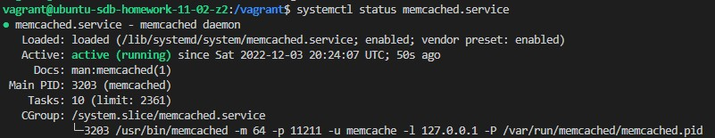
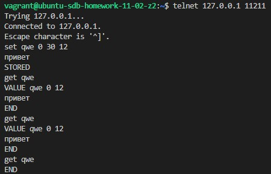

# Домашнее задание к занятию 11.2 "Кеширование Redis/memcached"

---

### Задание 1. Кэширование. 

Приведите примеры проблем, которые может решить кэширование. 

```
- Скорость ответа БД
- Увеличение производительносто ПО, работающего с БД
- Снижение вычислительной нагрузки
```

---

### Задание 2. Memcached.

Установите и запустите memcached.



---

### Задание 3. Удаление по TTL в Memcached.

Запишите в memcached несколько ключей с любыми именами и значениями, для которых выставлен TTL 5. 
```
Сделал TTL 30 секунд, чтобы было нагляднее:
set qwe 0 30 12
привет
STORED
get qwe
VALUE qwe 0 12
привет
END
get qwe
VALUE qwe 0 12
привет
END
get qwe
END
```


---

### Задание 4. Запись данных в Redis. 

Запишите в redis несколько ключей с любыми именами и значениями. 

*Через redis-cli достаньте все записанные ключи и значения из базы, приведите скриншот этой операции.*


## Дополнительные задания (со звездочкой*)
Эти задания дополнительные (не обязательные к выполнению) и никак не повлияют на получение вами зачета по этому домашнему заданию. Вы можете их выполнить, если хотите глубже и/или шире разобраться в материале.

### Задание 5*. Работа с числами. 

Запишите в redis ключ key5 со значением типа "int" равным числу 5. Увеличьте его на 5, чтобы в итоге в значении лежало число 10.  

*Приведите скриншот, где будут проделаны все операции и будет видно, что значение key5 стало равно 10.*
